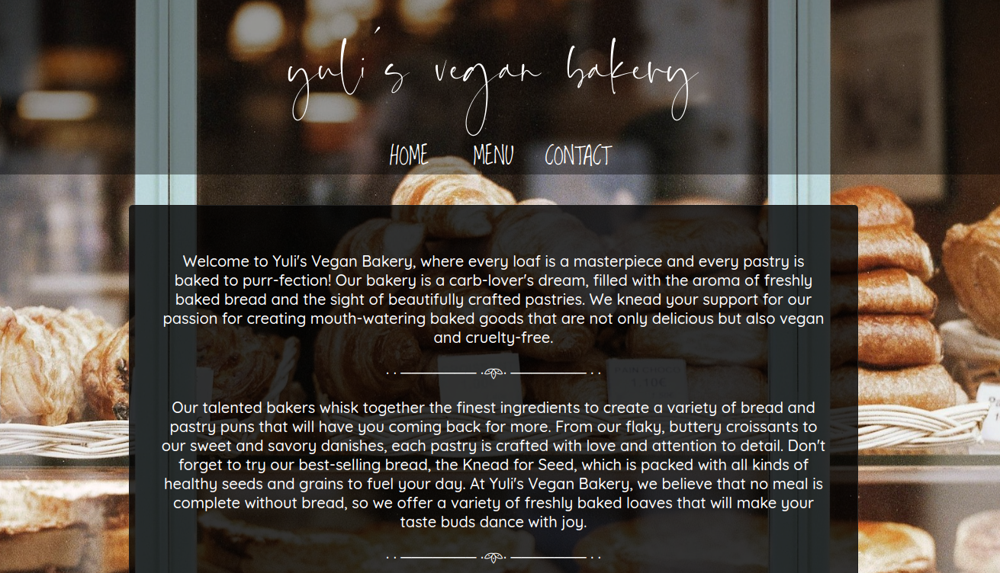

# Bakery Page
## Introduction

This project is a sample homepage for a bakery. It is built using the standard front-end stack of HTML, CSS and JavaScript bundled using Webpack.

The project primarily demonstrates use of npm to incorporate external JS modules, as well as use of Webpack to bundle files and add a build phase to front-end web projects.

## Preview

<!--  -->

## Media credits:

1. Flaticon: https://www.flaticon.com/free-icons/food-and-restaurant

2. Unsplash: https://unsplash.com/photos/R3iAcQxylmE